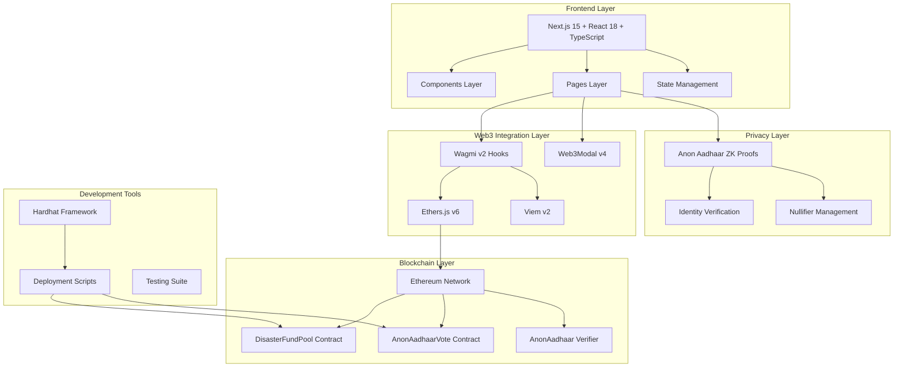
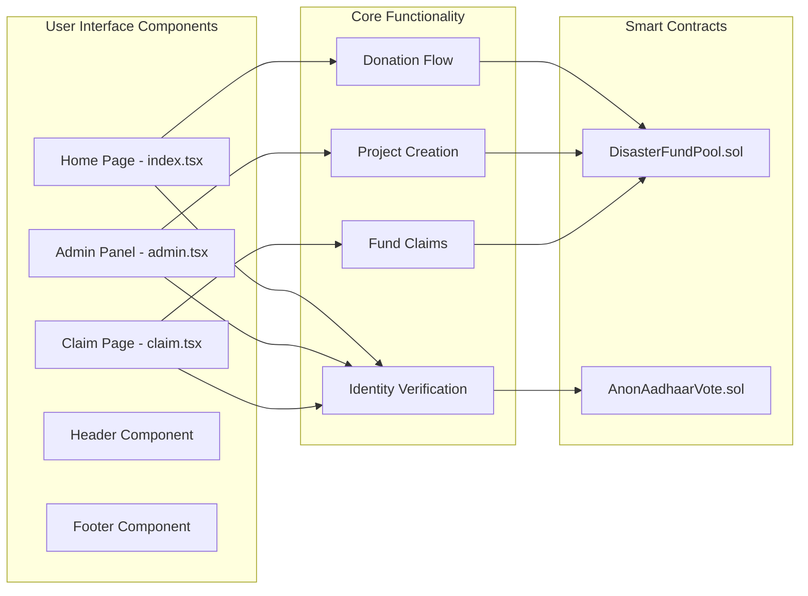
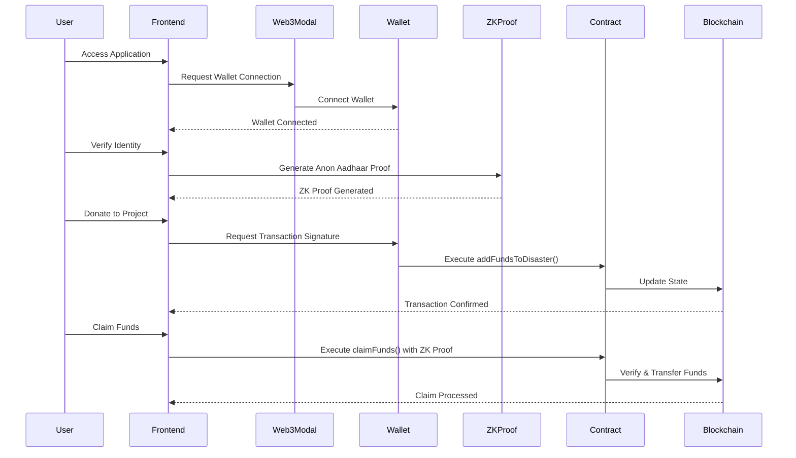
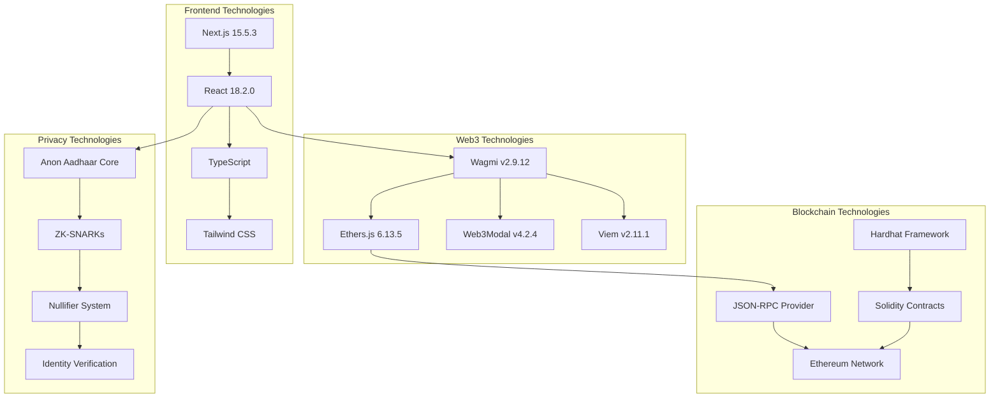
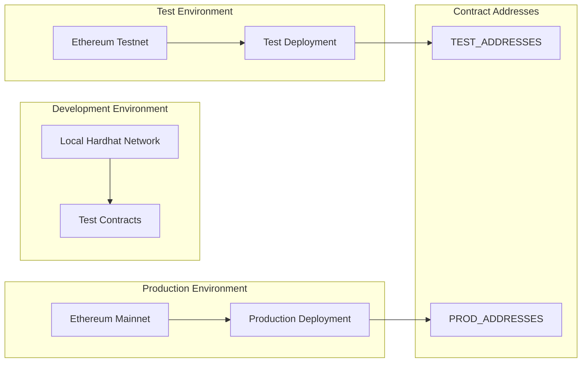
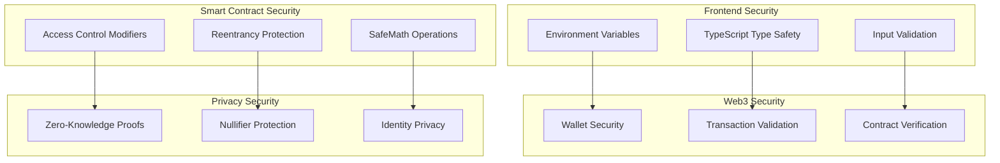
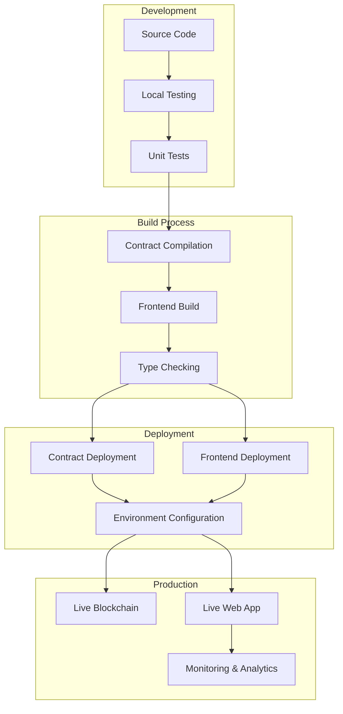

# Community Blockchain - Web3 Disaster Relief Fund Architecture

## System Architecture Overview



## Detailed Component Architecture



## Data Flow Architecture



## Technology Stack Architecture



## Smart Contract Architecture

```mermaid
graph TB
    subgraph "DisasterFundPool Contract"
        REGISTER[registerDisaster()]
        ADD_FUNDS[addFundsToDisaster()]
        CLAIM[claimFunds()]
        GET_DETAILS[getDisasterDetails()]
        SET_STATUS[setDisasterStatus()]
    end

    subgraph "AnonAadhaarVote Contract"
        VOTE_FUNC[vote()]
        CHECK_VOTED[checkVoted()]
        GET_RESULTS[getResults()]
    end

    subgraph "Verifier Contract"
        VERIFY[verifyProof()]
        NULLIFIER_CHECK[checkNullifier()]
    end

    subgraph "Access Control"
        OWNER[onlyOwner Modifier]
        DISASTER_EXISTS[disasterExists Modifier]
        VALID_PROOF[validZKProof Modifier]
    end

    REGISTER --> OWNER
    SET_STATUS --> OWNER
    ADD_FUNDS --> DISASTER_EXISTS
    CLAIM --> VALID_PROOF

    VOTE_FUNC --> VALID_PROOF
    CLAIM --> NULLIFIER_CHECK
    VOTE_FUNC --> NULLIFIER_CHECK
```

## File Structure Architecture

```
donation/
├── Frontend Layer
│   ├── src/
│   │   ├── components/       # Reusable UI Components
│   │   │   ├── Header.tsx    # Navigation & Wallet
│   │   │   ├── Footer.tsx    # App Footer
│   │   │   ├── Loader.tsx    # Loading States
│   │   │   └── Toaster.tsx   # Notifications
│   │   ├── pages/           # Next.js Pages
│   │   │   ├── index.tsx    # Home/Donation Page
│   │   │   ├── admin.tsx    # Project Management
│   │   │   ├── claim.tsx    # Fund Claims
│   │   │   ├── _app.tsx     # App Wrapper
│   │   │   └── _document.tsx # HTML Document
│   │   ├── styles/          # Global Styles
│   │   ├── config.ts        # Web3 Configuration
│   │   ├── utils.ts         # Blockchain Utilities
│   │   └── interface.ts     # TypeScript Interfaces
│   └── public/              # Static Assets & ABIs
│
├── Smart Contract Layer
│   └── contracts/
│       ├── contracts/       # Solidity Files
│       │   ├── DisasterFundPool.sol
│       │   └── AnonAadhaarVote.sol
│       ├── scripts/         # Deployment Scripts
│       │   └── deploy.cjs
│       ├── artifacts/       # Compiled Contracts
│       └── hardhat.config.cjs
│
└── Configuration Layer
    ├── package.json         # Dependencies
    ├── tsconfig.json       # TypeScript Config
    ├── tailwind.config.js  # Styling Config
    ├── next.config.js      # Next.js Config
    └── .env.local          # Environment Variables
```

## Network Architecture



## Security Architecture



## Deployment Architecture



## Key Architecture Benefits

### 🔒 **Security First**

- ZK-proof based identity verification
- Smart contract access controls
- Type-safe transactions

### ⚡ **Performance Optimized**

- Next.js server-side rendering
- Efficient blockchain interactions
- Optimized bundle sizes

### 🔄 **Scalable Design**

- Modular component architecture
- Environment-based deployments
- Extensible smart contracts

### 🌐 **Web3 Native**

- Multiple wallet support
- Real-time blockchain sync
- Decentralized state management

### 🎯 **User Experience**

- Responsive design
- Progressive Web App features
- Intuitive donation flows

This architecture ensures a robust, secure, and scalable Web3 application for disaster relief funding with privacy-preserving identity verification.
